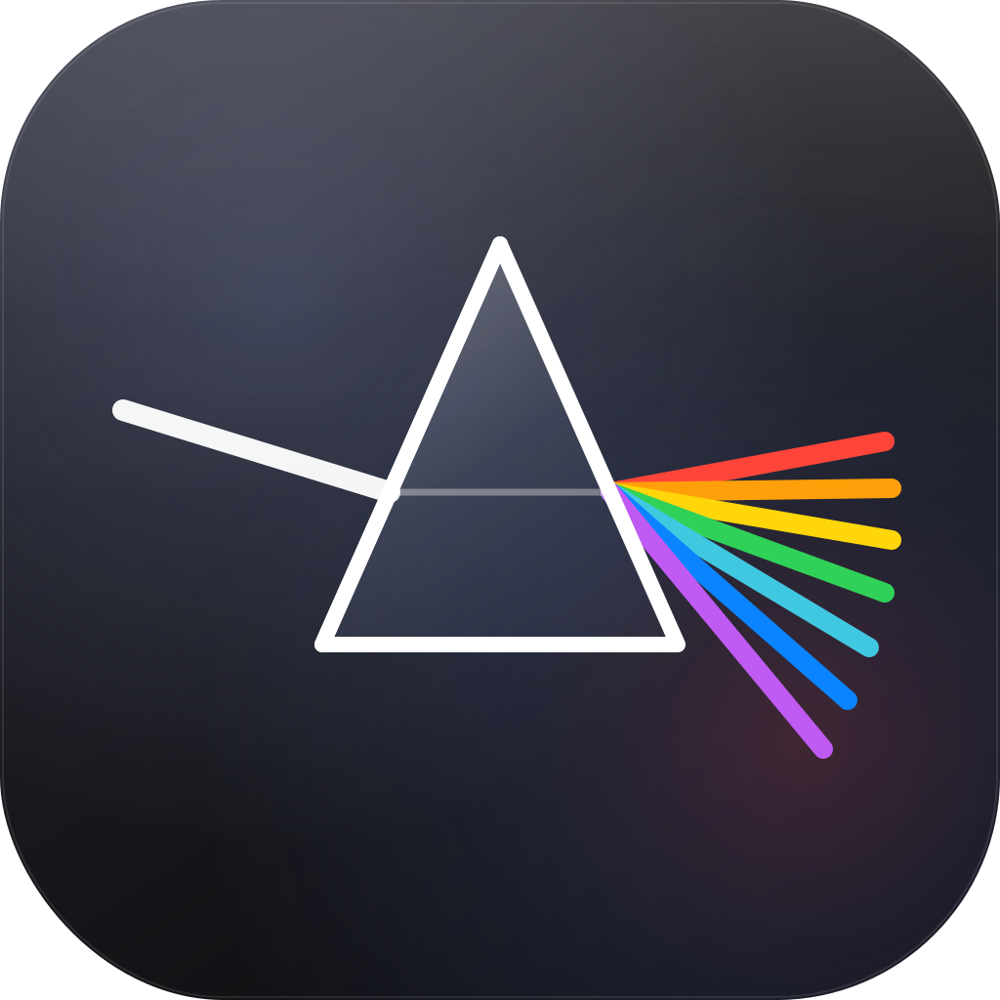

<div align="center">
  

  # PRISMA — Site

  Landing bilíngue (PT-BR / EN) do **PRISMA**, o gerenciador de mídia (DAM) grátis e offline para editores de vídeo e designers.

  **App:** https://github.com/Paulothedeveloper/prisma
</div>

## Stack
Vite + React + TypeScript. Identidade liquid-glass / espectro (Inter), 100% responsivo, sem tracking.

## Dev
```bash
npm install
npm run dev      # servidor local
npm run build    # gera dist/
```

## Deploy
GitHub Pages via GitHub Actions (`.github/workflows/deploy.yml`) a cada push na `main`.
